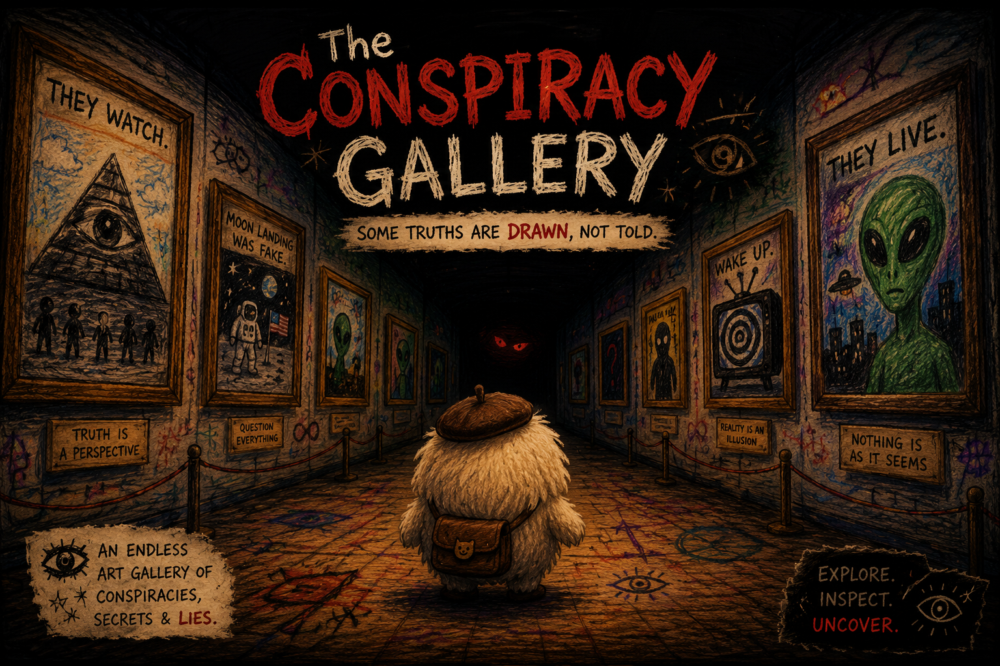

# 👁️ The Conspiracy Gallery



[Live Demo](https://paradive13.github.io/the-conspiracy-gallery/)

> “Some truths are drawn, not told.”

An eerie endless 3D art gallery where conspiracy theories come alive through creepy paintings, hidden lore, and unsettling discoveries.

---

## 🎮 About The Game

**The Conspiracy Gallery** is a psychological horror exploration experience inspired by internet mysteries, liminal spaces, weirdcore aesthetics, and conspiracy rabbit holes.

Walk through an infinite hand-drawn gallery filled with strange artwork covering:

- 👽 Aliens
- 🛸 UFOs
- 🧠 Mind Control
- 🕵️ Secret Organizations
- 🌎 Simulation Theory
- 👁️ Hidden Messages
- 📡 Government Experiments
- 🧩 Internet Mysteries

But the deeper you go...

the stranger the gallery becomes.

---

## ✨ Features

- 🖼️ Endless procedural gallery
- 🎨 Unique crayon horror art style
- 👁️ Hundreds of conspiracy paintings
- 🌫️ Atmospheric lighting & fog
- 🔊 Creepy ambient sound design
- 🧠 Hidden rare encounters
- 💀 Psychological horror vibes

---

## 🎮 Controls

| Key | Action |
|-----|--------|
| ← → | Move |
| SPACE | Inspect painting |
| ESC | Close inspection |

---

## ⚠️ Warning

This game contains:
- Psychological horror themes
- Creepy imagery
- Disturbing conspiracy content
- Flashing visuals

Best experienced:
🎧 With headphones  
🌑 In a dark room

---

## 🚀 Play The Game

Download and open:

```bash
index.html
```

in your browser.

---

## 🛠️ Built With

- HTML5
- CSS3
- JavaScript
- Three.js

---

## 👁️ Final Message

> “You were never supposed to find this gallery.”
